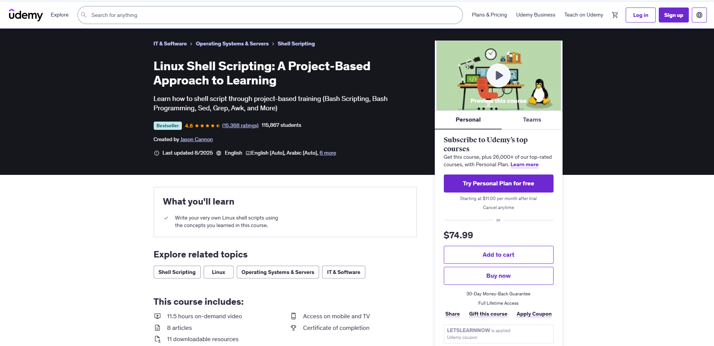

# Linux Shell Scripting: A Project-Based Approach to Learning


This repository contains my hands-on exercises and project code from the Udemy course [Linux Shell Scripting: A Project-Based Approach to Learning](https://www.udemy.com/course/linux-shell-scripting-projects/?couponCode=LETSLEARNNOW).

## 📚 Course Overview
The course focuses on learning Linux shell scripting through real-world projects. It covers a wide range of topics including:
- Basic shell scripting
- Conditional logic
- Loops and functions
- User and file management
- Automation with bash scripts

## 📁 Repository Structure

```
Linux Shell Scripting: A Project-Based Approach to Learning/
├── practices
└── exercises           
```

### 🚀 How to Use

```bash
# Clone the repository
git clone https://github.com/StewieGriffin17/Linux-Shell-Scripting-A-Project-Based-Approach-to-Learning.git

# Run scripts with: 
chmod +x script_name.sh
./script_name.sh
```

### 🛠️ Tools Used
- Bash
- Kali Linux
- Vim

### 📌 Notes
This repository is for personal learning and documentation purposes. Feel free to fork or star if you're following along the course!

### 📧 Contact
If you’re also taking the course or have questions, feel free to connect or raise an issue.

## 📄 License

All the codes are open source and available under the [MIT License](LICENSE).

@Anowarul_Asif
